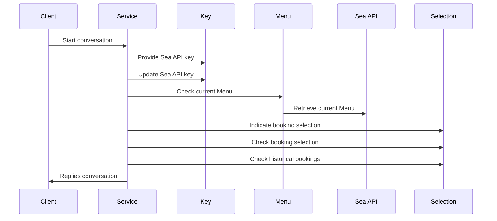
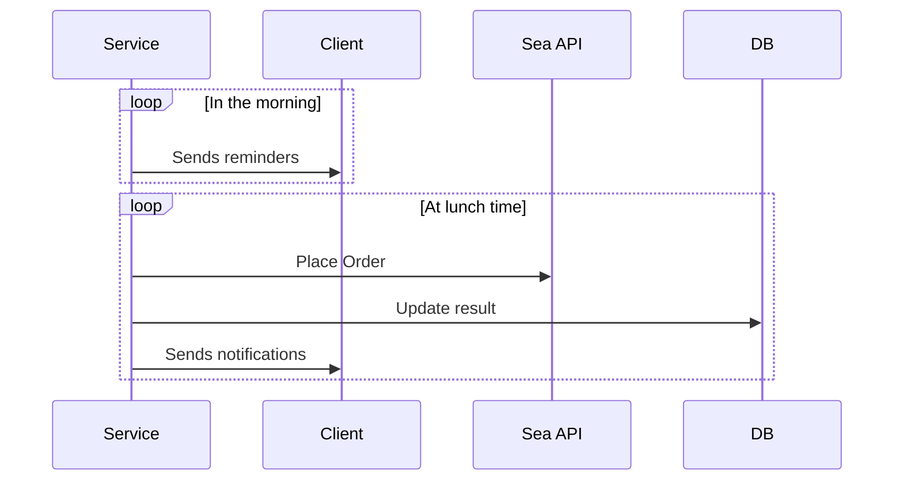

> **Warning**
> 
> Sea Dinner API is no longer available publicly, hence SeaHungerGamesBot is dead now :( 
> 
> R.I.P March ~ July 2022

<h1 align = "center"> SeaHungerGames </h1>

 <em>"May the odds be ever in your favor."</em> 

<h1> How To Use </h1>

1. Chat with `SeaHungerGamesBot` on Telegram.
2. Retrieve API key from https://dinner.sea.com/accounts/token, retrieve the token and tell the bot.
3. Play with the available commands:

| Command     | Description |
| ----------- | ----------- |
| `/start`    | Begin chatting with the bot. If it is your first time, the bot will prompt for your key.|
| `/key`      | Check if your key is remembered by the bot.|
| `/newkey`   | Update a new key.        |
| `/menu`     | Check today's menu and place your order.        |
| `/choice`   | Check the current food that you tasked the bot to order.        |
| `/status`   | Check the order status of the entire week.        |
| `/mute`     | Mute or unmute daily reminders.       |
| `/help`     | Introduction and help.        |

4. The bot will not entertain anymore requests 1 minute before `12.30pm`, and proceed to order for you.
5. It will tell you if the order is successful.
6. Remember to collect and eat it. Yumm.

<h1> Flow </h1>
<h2> Client Facing </h2>

<h2> Scheduled </h2>

